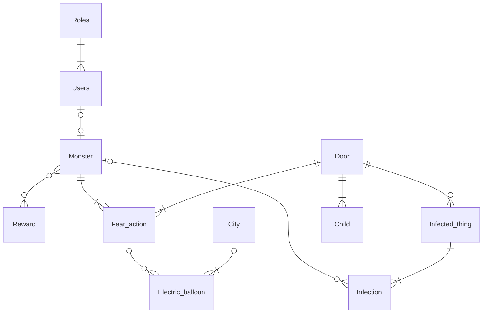

# High load systems lab

Task: https://github.com/andermirik/HighLoad/blob/main/labs/lab1.md 

Team:  
Ekaterina Polozova  
Polina Prokusheva  
Polina Popova  

### Subject area
Monsters, Inc. 
### Database architecture

  

